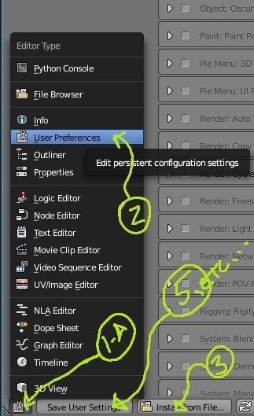
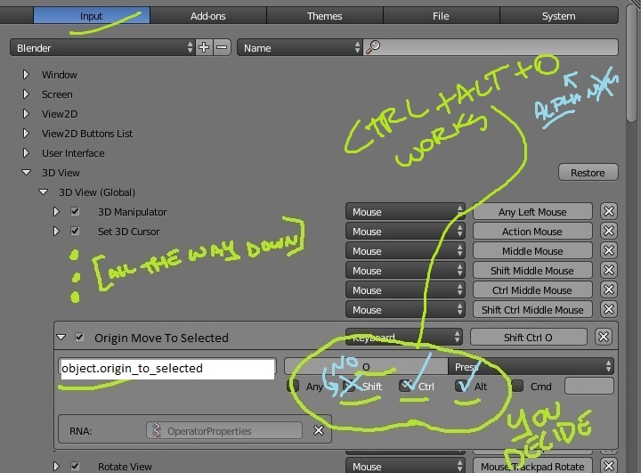

<!-- Author:tfw
Author-meta:tfw
Title:Blender Knob
Subtitle: and Post-Processing with ImageMagick
Date:20160306
Encoding:utf8
version:tfwio.wordpress.com
mainfont:Roboto Slab
monofont:FreeMono
monoscale:0.8
dh:8in
dw:5in
top:0.75in
bottom:0.75in
lr:0.35in -->

> This is a basic outline and demonstration of the things that I've learned while attempting to do this with blender and ImageMagick.
> 
> This (I don't beleive) isn't really going to be one of those copy/paste type of things.  You're going to need to become if not allready familiar with [Blender](http://blender.org) and perhaps (of course) have use for interest in knobs in IPLUG or something like.  The blender files use blender's "Cycles" renderer and a minimal amount of compositing which if you're new to can be a bit mind-bending to wrap your mind around at first glance—but, as you may find... The results are well worth it.
> 
> Not every technique (as found in the blender files) is likely documented as there may well be errors in some of the process I jotted down here (a year or so back).  This is just an initial dump of my notes with a little editing and am glad I jotted everything down since I had to re-read it a few times to catch back up to par—so please do bare with me as I refurbish over time!

![Example 33'rd frame; frame 32 of 64]

![Another Example (flipped 90deg for readability)]

## THINGS I MIGHT FORGET AGAIN (Blender)

**COPY STUFF FROM AN OBJECT TO MULTIPLE...**

- Select all your (target) objects
- Select the object you're copying (linking) properties from.
- Hit `Ctrl+L` to bring up the links menu. Choose Materials.

## BLENDING

Scripts and the blender process(s) are known to be working with ...

![Blender Version]

|3D View: Keyboard Shortcuts|keys|description|
|-----------------------|-------|-----|
|Apply Transformation   | `Ctrl+A`| Applies transformations such as location<br/>and rotation to an object's mesh|
|Layer Show    | `[0-9]` (alpha-num)  | show layer |
|Layer Toggle  | `Shift+[0-9]`| toggle layer on\|off |


- **INITIAL STEP**
    - Start up blender.
    - Set Cycles as Our Renderer  
      ![Set Cycles as Our Renderer]
    - Delete the box.
    - Set up the scene size.  I used a w/h of `256 x 256`.
    - Change Render settings modifying output path to `//` so that any images rendered will be in the same directory as the blend.
    - Save your file.
- **LIGHT SOURCE**
    - Select the default light.
    - Change it to a Sun lamp.
    - Change the X `Location` to 0.
    - Change the Y `Location` to 1 or whatever you like.
    - Change the Z `Location` to 2 or whatever you like.
    - Change the Rotations `X=32, Y=0 and Z=0`.
    - Note: You are going to want to customize the lighting settings when adjusting your knob's materials and finalizing (most likely).
- Set up your rendering settings.
    - Press the camera button
    - Goto the `Film` category and check the "Transparent" check-box so that we can have a transparent background.  
      ![Transparency-Setting]
    - Switch the renderer to cycles for later applying to your (knob's) materials.
- Design your knob
    - press 2 to go the second layer.
    - add plane (you can enlarge it now or later to fill the camera view).
    - press 1 to return to the first layer.
    - make your knob however you like.
          - you can generally as a rule of thumb just make sure you keep the cursor in the center of the object or knob that you're designing.
- Setup Animation Settings for the Knob
    - Go to your Time-line and Frame `0` within
    - Set this as your first frame or press `S`
    - Go to frame `64`
    - Set this as your last frame or press `E`
          - NOTE: we are only looking to animate the Z-axis of our knob.
    - Go back to your main Design or Default view
    - Next we'll create key-frames `@0`, `32` and `64` containing rotations: `-30°`, `-180°` and `-330°`.  
      we're going to want to set the initial rotation of our down-pointing knob to -30 deg and then apply our keyframes to the z-rotation.  
       note: *the `do-blend*` script is set to handle 64 frames (though actually 65 are rendered)*
      - Rotate on the z-axis -30 deg and **Apply Tranformation** pressing `Ctrl+A` within the mesh view.
          - *NOTE: the best way to set the z-rotation-transform is by right-clicking the z-transform button/slider thing and select `insert single keyframe` — this will only add the Z-Rotation transform and not all other transformations, keeping things clean.*
          - we want a middle keyframe pointed directly up or centered, so it would be best to use an odd number of frames such as the 65 or 33 (counting the 0th) used here, this way our center frame points up at 90 deg.
          - Go to Frame  0 and change Z rotation to -0 degrees. Press `I` and select Rotation.
          - Go to Frame 32 and change Z Rotation to -150. Press `I` and select Rotation.
          - Go to Frame 64 and change Z Rotation to -300. Press `I` and select Rotation.
    - Return back to the Time-line (or animation) view ('Dopesheet').  Expand the 'action' pertaining to your knob which we just set.
    - If you would like, you can select and delete `X Euler Rotation` and `Y Euler Rotation` leaving `Z Euler Rotation`.
    - Within the 'Dopesheet' view, select `Z Euler Rotation` by clicking on it and press `T` and select `Linear` interpolation.

![blender screen 1]

# Scripts Overview

They're designed so that you can drag-drop your blender file into them in windows.

- There are two basic scripts – though duplicates due to the whole x86 vs x64 thing.  Its important to note the names of the scripts because I'm using a x64 machine and its possible that we have a Win32 user reading this so...
- scripts with 'native' appended to the end of the file-name will call
    - on 64-bit platform, will call `c:\program files\blender\blender`
    - on 32-bit platform, will call `c:\program files\blender\blender`
- scripts with x86_64 appended to the end of the file-name will call
    -  `c:\program files (x86)\blender\blender`
- Mac or 'nix users are going to have to write their own shell script to render based on whatever windows command file.

**bash and windows-command scripts**

1. `do-blender-render-*.cmd` Uses blender and render each frame of our mesh-animation.
2. `do_magick_*-64.cmd` Uses Image Magick to tile and stitch each exported PNG file into a single image and resizes several dimensions vertically (for IPLUG graphics).  
Vertical tile image size widths generated are **96**, **72**, **64**, **48**, **40**, **36**, **32**, **24** and **20**.  Heighth (automated) pending an input parameter depends on the number of projected image-tiles used.
Look toward the bottom of `ren.sh` to add whatever dimension you like.
    - Modify/clone, read and/or change the above to tailor it to whatever your desired frame-count.

# TIPS

SOME TEXTURING NOTES
--------------------

 - [Blender Quick Tip - Transparent Shadow in Final Render - YouTube](https://www.youtube.com/watch?v=nattlrdnEPM)
 - [Texture Nodes --- Blender Reference Manual](https://www.blender.org/manual/render/cycles/nodes/textures.html)


SOME MATH
--------------------------

Say you want to round a 7 (or other) pointed knob.

> You always want an odd number of nodal (or rotational) points.  
> NB: otherwise, there is not going to be a center-point (point straight up for example)

Grab your calculator and prep some calculations...

```
# Basic (first) angle

360 / 7 = ...

So...

[1] = 0
[2] = 51.428571428571428571428571428571
[3] = 102.85714285714285714285714285714
[4] = 154.28571428571428571428571428571
[5] = 205.71428571428571428571428571428
[6] = 257.14285714285714285714285714286
[7] = 308.57142857142857142857142857143
```

So as shown in the following figure, when 'meshing', we would simply create the first element in the perceived (y-axis) top, with the mesh's zero point set to the scene's 0,0,0 vector at which point we can just duplicate and rotate per interval above.  A plug-in would be nice for this, but I don't think a knob factory is really in order as you can just save your results for repeating once done.

Once the mesh is completed, we would apply a boolean difference (might want to recalculate normals first on the above created mesh).

![Bitwise Mask]

## Image-Magick under msys2

You're going to want to kick me reading this knowing full well that image-magick is broke in several distributions; Just skip below and download/install a working version silly.  I'm not a 'nix user, so you're going to have to consult your package-management (or managers) to figure out what versions are going to work for you.  Chances are, if you're on linux (or mac) the package managers aren't lazy and patched the issues or filed a bug report AND of course one would hope that those reports were acted upon by Image-Magick builders/devs.  Its not your package manager's responsibilty to fix issues like this---and they bring you everyhing you use, so be respectful ;)

For a windows user on msys2 to manually install your msys2 imagemagick package, load up msys2 bash and

```bash
# assuming the package is in your downloads directory...
cd /c/users/[your-username-on-your-machine]/downloads

pacman -U [your-package-name].pkg.tar.xz

# if you only downloaded one package and its in your downloads directory...
# pacman -U *.pkg.tar.xz

# or even
# pacman -U *.xz

# you get the idea
```

and follow along the ^provided instruction^ once running pacman's update command.

## How I got the following list of files...

You'll notice the following lists.  If you're ever looking to find a (further) downstream package for msys2, you might want to do as I did and download the appropriate FILES page so you can search for what you're looking for much faster using something like sublime-text and regular expressions.

In this particular case, I knew I was looking for `imagemagick`

- right-click, download the single html file and load in your regex-search capable text-editor.
    - https://sourceforge.net/projects/msys2/files/REPOS/MINGW/i686/
    - https://sourceforge.net/projects/msys2/files/REPOS/MINGW/x86_64/

Once I found the package-uri, it was simple to convert it into a regex query that would allow me to find each release.

for example: `href="https://sourceforge.net/projects/msys2/files/REPOS/MINGW/x86_64/mingw-w64-x86_64-imagemagick-[^]["]*` or for i686, `href="https://sourceforge.net/projects/msys2/files/REPOS/MINGW/i686/mingw-w64-x86_64-imagemagick-[^]["]*`

## Working x86 Image Magick for msys2

These are on the source-forge files section of msys2... I'm sure one of these will do—just forgot which one. I've got money on [mingw-w64-i686-imagemagick-6.9.3.7-1-any.pkg.tar.xz] one of the v6.x ;)

Emboldened is the working version.

*guessing you don't really care about the sig files...*  
*If you want to download one, just copy/paste one of the following links and append `.sig`*  
*note: you're not going to want to r-click/save-as these as they're redirect pages.*

- [mingw-w64-i686-imagemagick-7.0.4.4-1-any.pkg.tar.xz]
- [mingw-w64-i686-imagemagick-7.0.3.5-2-any.pkg.tar.xz]
- [mingw-w64-i686-imagemagick-7.0.3.5-2-any.pkg.tar.xz]
- [mingw-w64-i686-imagemagick-7.0.3.1-1-any.pkg.tar.xz]
- [mingw-w64-i686-imagemagick-7.0.1.10-1-any.pkg.tar.xz]
- [mingw-w64-i686-imagemagick-7.0.1.9-1-any.pkg.tar.xz]
- [mingw-w64-i686-imagemagick-7.0.1.8-1-any.pkg.tar.xz]
- **[mingw-w64-i686-imagemagick-6.9.3.7-1-any.pkg.tar.xz]**
- [mingw-w64-i686-imagemagick-6.9.2.10-1-any.pkg.tar.xz]
- [mingw-w64-i686-imagemagick-6.9.2.0-1-any.pkg.tar.xz]
- [mingw-w64-i686-imagemagick-6.9.1.8-1-any.pkg.tar.xz]

## Working x64 Image Magick for msys2

*guessing you don't really care about the sig files...*  
*If you want to download one, just copy/paste one of the following links and append `.sig`*  
*note: you're not going to want to r-click/save-as these as they're redirect pages.*

- [mingw-w64-x86_64-imagemagick-7.0.5.0-1-any.pkg.tar.xz]
- [mingw-w64-x86_64-imagemagick-7.0.4.4-1-any.pkg.tar.xz]
- [mingw-w64-x86_64-imagemagick-7.0.3.5-2-any.pkg.tar.xz]
- [mingw-w64-x86_64-imagemagick-7.0.3.1-1-any.pkg.tar.xz]
- [mingw-w64-x86_64-imagemagick-7.0.1.10-1-any.pkg.tar.xz]
- [mingw-w64-x86_64-imagemagick-7.0.1.9-1-any.pkg.tar.xz]
- [mingw-w64-x86_64-imagemagick-7.0.1.8-1-any.pkg.tar.xz]
- **[mingw-w64-x86_64-imagemagick-6.9.3.7-1-any.pkg.tar.xz]**
- [mingw-w64-x86_64-imagemagick-6.9.2.10-1-any.pkg.tar.xz]
- [mingw-w64-x86_64-imagemagick-6.9.2.0-1-any.pkg.tar.xz]
- [mingw-w64-x86_64-imagemagick-6.9.1.8-1-any.pkg.tar.xz]


[mingw-w64-i686-imagemagick-7.0.4.4-1-any.pkg.tar.xz]:    https://sourceforge.net/projects/msys2/files/REPOS/MINGW/i686/mingw-w64-i686-imagemagick-7.0.4.4-1-any.pkg.tar.xz/download
[mingw-w64-i686-imagemagick-7.0.3.5-2-any.pkg.tar.xz]:    https://sourceforge.net/projects/msys2/files/REPOS/MINGW/i686/mingw-w64-i686-imagemagick-7.0.3.5-2-any.pkg.tar.xz/download
[mingw-w64-i686-imagemagick-7.0.3.5-2-any.pkg.tar.xz]:    https://sourceforge.net/projects/msys2/files/REPOS/MINGW/i686/mingw-w64-i686-imagemagick-7.0.3.5-2-any.pkg.tar.xz/download
[mingw-w64-i686-imagemagick-7.0.3.1-1-any.pkg.tar.xz]:    https://sourceforge.net/projects/msys2/files/REPOS/MINGW/i686/mingw-w64-i686-imagemagick-7.0.3.1-1-any.pkg.tar.xz/download
[mingw-w64-i686-imagemagick-7.0.1.10-1-any.pkg.tar.xz]:   https://sourceforge.net/projects/msys2/files/REPOS/MINGW/i686/mingw-w64-i686-imagemagick-7.0.1.10-1-any.pkg.tar.xz/download
[mingw-w64-i686-imagemagick-7.0.1.9-1-any.pkg.tar.xz]:    https://sourceforge.net/projects/msys2/files/REPOS/MINGW/i686/mingw-w64-i686-imagemagick-7.0.1.9-1-any.pkg.tar.xz/download
[mingw-w64-i686-imagemagick-7.0.1.8-1-any.pkg.tar.xz]:    https://sourceforge.net/projects/msys2/files/REPOS/MINGW/i686/mingw-w64-i686-imagemagick-7.0.1.8-1-any.pkg.tar.xz/download
[mingw-w64-i686-imagemagick-6.9.3.7-1-any.pkg.tar.xz]:    https://sourceforge.net/projects/msys2/files/REPOS/MINGW/i686/mingw-w64-i686-imagemagick-6.9.3.7-1-any.pkg.tar.xz/download
[mingw-w64-i686-imagemagick-6.9.2.10-1-any.pkg.tar.xz]:   https://sourceforge.net/projects/msys2/files/REPOS/MINGW/i686/mingw-w64-i686-imagemagick-6.9.2.10-1-any.pkg.tar.xz/download
[mingw-w64-i686-imagemagick-6.9.2.0-1-any.pkg.tar.xz]:    https://sourceforge.net/projects/msys2/files/REPOS/MINGW/i686/mingw-w64-i686-imagemagick-6.9.2.0-1-any.pkg.tar.xz/download
[mingw-w64-i686-imagemagick-6.9.1.8-1-any.pkg.tar.xz]:    https://sourceforge.net/projects/msys2/files/REPOS/MINGW/i686/mingw-w64-i686-imagemagick-6.9.1.8-1-any.pkg.tar.xz/download
[mingw-w64-x86_64-imagemagick-7.0.5.0-1-any.pkg.tar.xz]:  https://sourceforge.net/projects/msys2/files/REPOS/MINGW/x86_64/mingw-w64-x86_64-imagemagick-7.0.5.0-1-any.pkg.tar.xz/download
[mingw-w64-x86_64-imagemagick-7.0.4.4-1-any.pkg.tar.xz]:  https://sourceforge.net/projects/msys2/files/REPOS/MINGW/x86_64/mingw-w64-x86_64-imagemagick-7.0.4.4-1-any.pkg.tar.xz/download
[mingw-w64-x86_64-imagemagick-7.0.3.5-2-any.pkg.tar.xz]:  https://sourceforge.net/projects/msys2/files/REPOS/MINGW/x86_64/mingw-w64-x86_64-imagemagick-7.0.3.5-2-any.pkg.tar.xz/download
[mingw-w64-x86_64-imagemagick-7.0.3.1-1-any.pkg.tar.xz]:  https://sourceforge.net/projects/msys2/files/REPOS/MINGW/x86_64/mingw-w64-x86_64-imagemagick-7.0.3.1-1-any.pkg.tar.xz/download
[mingw-w64-x86_64-imagemagick-7.0.1.10-1-any.pkg.tar.xz]: https://sourceforge.net/projects/msys2/files/REPOS/MINGW/x86_64/mingw-w64-x86_64-imagemagick-7.0.1.10-1-any.pkg.tar.xz/download
[mingw-w64-x86_64-imagemagick-7.0.1.9-1-any.pkg.tar.xz]:  https://sourceforge.net/projects/msys2/files/REPOS/MINGW/x86_64/mingw-w64-x86_64-imagemagick-7.0.1.9-1-any.pkg.tar.xz/download
[mingw-w64-x86_64-imagemagick-7.0.1.8-1-any.pkg.tar.xz]:  https://sourceforge.net/projects/msys2/files/REPOS/MINGW/x86_64/mingw-w64-x86_64-imagemagick-7.0.1.8-1-any.pkg.tar.xz/download
[mingw-w64-x86_64-imagemagick-6.9.3.7-1-any.pkg.tar.xz]:  https://sourceforge.net/projects/msys2/files/REPOS/MINGW/x86_64/mingw-w64-x86_64-imagemagick-6.9.3.7-1-any.pkg.tar.xz/download
[mingw-w64-x86_64-imagemagick-6.9.2.10-1-any.pkg.tar.xz]: https://sourceforge.net/projects/msys2/files/REPOS/MINGW/x86_64/mingw-w64-x86_64-imagemagick-6.9.2.10-1-any.pkg.tar.xz/download
[mingw-w64-x86_64-imagemagick-6.9.2.0-1-any.pkg.tar.xz]:  https://sourceforge.net/projects/msys2/files/REPOS/MINGW/x86_64/mingw-w64-x86_64-imagemagick-6.9.2.0-1-any.pkg.tar.xz/download
[mingw-w64-x86_64-imagemagick-6.9.1.8-1-any.pkg.tar.xz]:  https://sourceforge.net/projects/msys2/files/REPOS/MINGW/x86_64/mingw-w64-x86_64-imagemagick-6.9.1.8-1-any.pkg.tar.xz/download


# A Helpful   Blender-Python Script


One script was particularly helpful: `space_view3d_move_origin.py`.  
I'd placed it into the `./blender-mods` directory.


```python
'''
BEGIN GPL LICENSE BLOCK
This program is free software; you can redistribute it and/or
modify it under the terms of the GNU General Public License
as published by the Free Software Foundation; either version 2
of the License, or (at your option) any later version.
This program is distributed in the hope that it will be useful,
but WITHOUT ANY WARRANTY; without even the implied warranty of
MERCHANTABILITY or FITNESS FOR A PARTICULAR PURPOSE.    See the
GNU General Public License for more details.
You should have received a copy of the GNU General Public License
along with this program; if not, write to the Free Software Foundation,
Inc., 59 Temple Place - Suite 330, Boston, MA  02111-1307, USA.
END GPL LICENCE BLOCK
'''

bl_info = {
    'name': 'Move origin to selected',
    'author': '',
    'version': (0, 0, 1),
    'blender': (2, 6, 7),
    'location': '3d view > space bar > Origin Move to Selected',
    'description': 'in edit mode, sets object origin to the median of selected verts/edges/faces',
    'wiki_url': '',
    'tracker_url': '',
    'category': '3D View'}
```


When you're in mesh mode, (where you edit mesh vertexes, lines or faces; not in object-mode) you might want to use the cursor to set the center-point of your mesh.  This is particularly useful when you have edited a knob or whatever and you need to manually set its **rotation-center**.  
*this was handy when setting up the 7-sided boolean cylendars (as in some exaple in here)*

In case you need some help **Installing and configuring the python script**

1. Click your Window-Selector Icon in the 3D-view
2. Select **User Preferences**
3. Click **Add-ons** tab at the top
4. Click on the **Install from file…** button
5. Check/Enable the script
6. **SAVE YOUR SETTINGS** by clicking the **Save User Settings** button
7. Click the **Input** tab on the top of the **User Preferences** page
8. Expand the node **3D View Global** and Scroll to the bottom of the tree-node
9. Click the **Add New** button.
10. Type `object.origin_to_selected` into the text-input box in the upper-left of the added entry-box
11. Configure the rest of the options...
    - (for a keyboard shortcut) Select `Keyboard` in the topmost group-box column-header
    - Click on the Key (probably reads `A`) and depress `O` (upper-case)
    - Place a check in `Ctrl` and `Alt` check-boxes
    - [thats what I did at least]
12. **SAVE YOUR SETTINGS AGAIN** by clicking the **Save User Settings** button

***Note that `Ctrl+Alt+O` in object mode will prompt you to load a mesh to link into the current scene.***

[so I'd gotten the numbering a bit wrong ;)]

  
  
  
  

[Set Cycles as Our Renderer]: doc/000.jpg
[Example 33'rd frame; frame 32 of 64]: doc/001.jpg
[Another Example (flipped 90deg for readability)]: doc/002.png
[Blender Version]: doc/003.jpg
[blender screen 1]: doc/004.jpg
[Transparency-Setting]: doc/005.jpg
[Bitwise Mask]: doc/knob_corners.png
